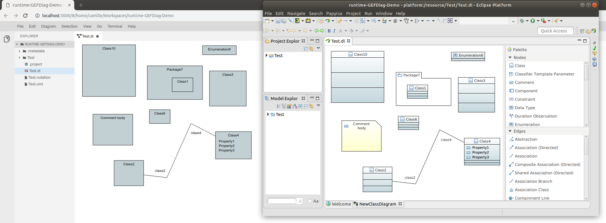

# Papyrus GEFx & GLSP (PoC) Integration

Example integration of an Eclipse/Papyrus/GEFx Server in GLSP.

This project also provides a simple (generic) GLSP Client 

This is a proof-of-concept on how to integrate existing diagram technologies with the Graphical Language Server Protocol, to quickly get started with Web-based Diagrams.

This project depends on (and integrates):

- GLSP: https://github.com/eclipsesource/graphical-lsp
- Papyrus-GEFx: https://github.com/eclipsesource/papyrus-gefx

Indirect dependencies include:

- Eclipse: https://www.eclipse.org
- Eclipse Papyrus: https://www.eclipse.org/papyrus
- Eclipse GEF (5.x): https://www.eclipse.org/gef
- Eclipse Sprotty: https://github.com/eclipse/sprotty
- Eclipse Theia: https://www.theia-ide.org

The current version supports Opening and displaying a simple Papyrus-GEFx Diagram (e.g. Papyrus UML Class Diagram), and to Create, Move or Resize nodes in that diagram.

Because this project is a Proof of Concept, integrating 2 incubating components, there are many limitations making it unusable in practice. Especially, Papyrus-GEFx doesn't support headless runtime yet, which means the server can only be started from a complete Eclipse IDE Application.

Styling is not supported yet

Side-by-side comparison (Left: Web-based GLSP client; right: Papyrus-GEFx GLSP Server, started in the Eclipse IDE):



## How to build

### Client

The build requirements (Node, Yarn, Lerna...) are similar to GLSP; see https://github.com/eclipsesource/graphical-lsp

Once all the required tools are installed, you can build the client with:

```
cd ~Git/papyrus-gefx-glsp/client
yarn
```

And then start the client application with:

```
cd papyrus-gefx/browser-app
yarn start
```

### Server

There is currently no automated build for this project. The build process is similar to Papyrus-GEFx (Including the Java 11, E(fx)clipse 3.5.0 IDE & OpenJFX 11 requirements). This project adds 2 plug-ins on top of any (recent) Papyrus-GEFx installation: one to wrap pre-built Sprotty and GLSP-Server jars into an Eclipse Plug-in, and one to actually integrate Papyrus-GEFx and GLSP.

